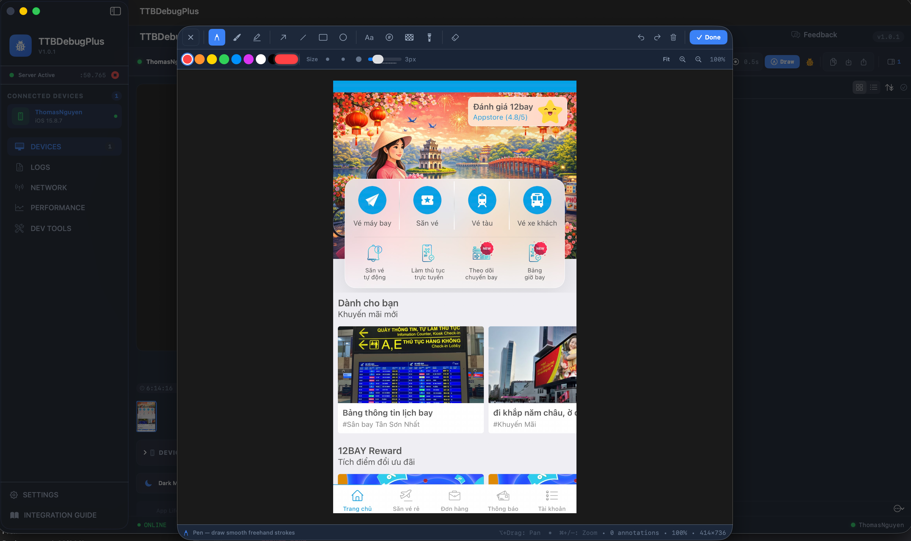

# TTBDebugPlus

**A professional-grade macOS companion app for debugging iOS applications in real-time.**

View logs, inspect network requests, export to Postman, analyze API performance, capture remote screenshots, and manage debug sessions — all from your Mac with zero configuration.

<p align="center">
  
</p>

| | |
|---|---|
| **Platform** | macOS 14.0+ |
| **Architecture** | SwiftUI + Bonjour (mDNS) + WebSocket |
| **iOS SDK** | Included in [TTBaseUIKit](https://github.com/tqtuan1201/TTBaseUIKit) (v2.3.0+) |
| **Download** | [Web Download](https://tqtuan1201.github.io/public/docs/ttbaseuikit/apps/TTBDebugPlus-Installer.dmg) · [Repo Installer](apps-build-dmg/TTBDebugPlus-Installer.dmg) (~5.8 MB) |
| **Documentation** | [Official Docs](https://tqtuan1201.github.io/public/docs/ttbaseuikit/ttbdebugplus.html) |

---

## How It Works

TTBDebugPlus uses **Bonjour (mDNS)** for zero-configuration discovery and **WebSocket** for real-time, bidirectional communication between your iOS app and macOS. Both devices must be on the same Wi-Fi network — auto-connects in < 2 seconds.

```
┌──────────────┐     Bonjour Discovery     ┌──────────────────┐
│   iOS App    │ ◄──────────────────────► │  TTBDebugPlus    │
│  (iPhone /   │     WebSocket Stream      │  (macOS App)     │
│  Simulator)  │ ──────────────────────► │                  │
└──────────────┘   Logs / API / Device     └──────────────────┘
```

---

## Features

### 📋 Live Console
- Filter by level: `Error`, `Warning`, `Info`, `Debug`
- Full-text search with highlight matching
- Click to expand JSON payload details
- Auto-scroll LIVE mode

### 🌐 Network Inspector v2
- **JSON Tree Viewer** — collapsible nodes, Pretty / Tree / Raw modes
- **Deep Search** — filter by URL, Body, Headers scopes
- **Pin/Bookmark** ⭐ requests, waterfall timing bars
- **Export** as cURL, Postman Collection (v2.1), context menus
- **API Analytics Dashboard** — method/status distribution, slowest requests

### 📱 Device Control
- Remote screenshot capture & recording
- Toggle Dark Mode, Reduced Motion
- App lifecycle: Launch, Kill, Reset Sandbox
- Accessibility overrides

### 📊 Performance Monitor
- CPU & Memory usage charts
- FPS counter and disk usage
- Network bandwidth monitoring
- Slow request & duplicate detection

### 📝 Feedback Reporter
- Create structured bug reports
- Auto-tag: UI/UX, Network, Crash
- Attach annotated screenshots (full drawing tools: pen, arrow, rectangle, text, color picker)
- Export as Markdown

### 🔄 Export & Share v2
- **Postman Collection v2.1** — one-click import
- **cURL** for Terminal replay
- **Session files** (`.ttbdebug`) — share debug sessions between team members
- Context menu: copy URL, headers, body, JSON payload

### 🛠 Dev Tools — JSON Editor
- Professional JSON Editor with Code, Tree, Graph, and Split views
- Syntax highlighting, search, format, minify, and diff

### 🖥 Dev Tools — Localhost Servers
- Discover TCP listeners on your Mac (port, PID, process name)
- Save project servers (command + working directory + preferred port)
- Start / stop / restart with live log tail
- Soft-stop or force-kill with confirmation; protect TTBDebugPlus debug ports
- Port conflict sheet when a preferred port is already in use

### 🎨 Dev Tools — Color Picker
- Sample any on-screen pixel with the system eyedropper (`NSColorSampler`)
- Export developer-ready formats: Hex, RGB, HSL, SwiftUI, UIColor, NSColor, CSS
- Session palette (today’s colors) with export as JSON
- WCAG contrast checker (foreground / background → AA / AAA)
- Design token match against TTBDebugPlus semantic colors (e.g. `.ttPrimary`)

---

## Installation (macOS App)

**Option A — Download from web:**

1. **Download** — [TTBDebugPlus-Installer.dmg](https://tqtuan1201.github.io/public/docs/ttbaseuikit/apps/TTBDebugPlus-Installer.dmg)

**Option B — Use the installer bundled in this repo:**

1. **Download** — [`apps-build-dmg/TTBDebugPlus-Installer.dmg`](apps-build-dmg/TTBDebugPlus-Installer.dmg)

**Then:**

2. **Install** — Open the DMG, drag **TTBDebugPlus** to your Applications folder
3. **Launch** — Open TTBDebugPlus from Applications. It sits in the menu bar ready to go

---

## iOS SDK Integration

<!-- NOTE: This section mirrors the 6-step in-app guide in
     TTBDebugPlus/source/TTBDebugPlus/Views/Guide/IntegrationGuideView.swift's `steps` array
     (same content, shown inside the macOS app too). Keep both in sync when editing either one. -->

The iOS SDK is included in the **TTBaseUIKit** package via the `DebugBridge` module. Connect your iOS app to TTBDebugPlus in minutes.

### Step 1 — Add TTBaseUIKit via SPM

**Package.swift:**

```swift
dependencies: [
    .package(
        url: "https://github.com/tqtuan1201/TTBaseUIKit.git",
        from: "2.3.0"
    )
]
```

**Or via Xcode:**

`File → Add Package Dependencies...` → URL: `https://github.com/tqtuan1201/TTBaseUIKit.git`

### Step 2 — Configure Info.plist (Required)

iOS 14+ requires local network access declarations. Missing this causes **"NoAuth -65555"** error.

```xml
<!-- Add to your iOS app's Info.plist -->

<!-- Required: Describe why local network access is needed -->
<key>NSLocalNetworkUsageDescription</key>
<string>Required for connecting to TTBDebugPlus on macOS to stream debug logs.</string>

<!-- Required: Declare Bonjour service type -->
<key>NSBonjourServices</key>
<array>
    <string>_ttbdebug._tcp</string>
</array>

<!-- Only needed if you use the built-in QR pairing scanner (DebugBridgeStatusView) -->
<key>NSCameraUsageDescription</key>
<string>Used to scan the TTBDebugPlus pairing QR code.</string>
```

### Step 3 — Start the Debug Bridge

Initialize in your `AppDelegate` or `SceneDelegate`. Always wrap in `#if DEBUG` to exclude from production builds.

**UIKit:**

```swift
import TTBaseUIKit

// AppDelegate.swift
func application(
    _ application: UIApplication,
    didFinishLaunchingWithOptions launchOptions: [UIApplication.LaunchOptionsKey: Any]?
) -> Bool {

    #if DEBUG
    // Start bridge — auto-discovers macOS app via Bonjour
    TTDebugBridge.shared.start()

    // (Optional) Auto-intercept console logs
    LogInterceptor.shared.install()
    #endif

    return true
}
```

**SwiftUI:**

```swift
import TTBaseUIKit

@main
struct MyApp: App {
    init() {
        #if DEBUG
        TTDebugBridge.shared.start()
        LogInterceptor.shared.install()
        #endif
    }

    var body: some Scene {
        WindowGroup { ContentView() }
    }
}
```

### Step 4 — Send API Logs

In your network layer, call `sendAPILog` to forward request/response data. Data appears in the Network tab with JSON viewer, waterfall timing, and export options.

```swift
#if DEBUG
TTDebugBridge.shared.sendAPILog(
    method: request.httpMethod ?? "GET",
    url: request.url?.absoluteString ?? "",
    statusCode: (response as? HTTPURLResponse)?.statusCode ?? 0,
    requestHeaders: request.allHTTPHeaderFields ?? [:],
    requestBody: String(data: request.httpBody ?? Data(), encoding: .utf8) ?? "",
    responseHeaders: (response as? HTTPURLResponse)?.allHeaderFields as? [String: String] ?? [:],
    responseBody: String(data: responseData, encoding: .utf8) ?? "",
    durationMs: elapsedTime * 1000,
    sizeBytes: responseData.count
)
#endif
```

### Step 5 — Send Console Logs

Three methods available — choose one:

```swift
// ── Method 1: TTBPrint() — replaces print() ──
TTBPrint("User logged in", level: "info", subsystem: "Auth")
TTBPrint("API error", level: "error", subsystem: "Network")

// ── Method 2: sendConsoleLog() — manual ──
#if DEBUG
TTDebugBridge.shared.sendConsoleLog(
    level: "debug",       // debug | info | warning | error
    subsystem: "Network", // module name
    message: "User profile loaded successfully",
    sourceFile: #file,
    sourceLine: #line
)
#endif

// ── Method 3: LogInterceptor — hook existing calls ──
#if DEBUG
LogInterceptor.shared.interceptConsoleLog(
    message: "Something happened",
    level: "warning",
    subsystem: "Analytics"
)
#endif
```

### Step 6 — Run & Verify

1. Ensure Mac and iPhone/Simulator are on the **same Wi-Fi network**
2. Open **TTBDebugPlus** on Mac
3. Build & Run your iOS app

**Expected console output:**

```
// ✅ iOS Xcode Console:
[TTDebugBridge] 🔍 Started browsing for debug services...
[TTDebugBridge] 📡 Found service: xxx._ttbdebug._tcp.local.
[TTDebugBridge] ✅ Connected to macOS app!

// ✅ TTBDebugPlus macOS:
[TTBDebug] 🚀 Connection manager started
[TTBDebug] ✅ Bonjour advertiser ready on port 50689
// Sidebar: iPhone appears with name + version
```

**Optional — Monitor connection state:**

```swift
TTDebugBridge.shared.onStateChange = { state in
    print("[Debug] Bridge state: \(state.rawValue)")
    // States: idle → browsing → connecting → connected
}
```

**Optional — Advanced configuration:**

```swift
var config = TTDebugBridge.Config()
config.heartbeatInterval = 5.0    // seconds (default)
config.maxBufferedMessages = 200   // buffer when offline
config.reconnectMaxDelay = 30.0    // max reconnect delay
TTDebugBridge.shared.config = config
```

---

## Complete Working Example

Copy this minimal full setup into your AppDelegate:

```swift
import UIKit
import TTBaseUIKit

@main
class AppDelegate: UIResponder, UIApplicationDelegate {

    func application(
        _ application: UIApplication,
        didFinishLaunchingWithOptions launchOptions: [UIApplication.LaunchOptionsKey: Any]?
    ) -> Bool {

        #if DEBUG
        // 1. Start bridge — auto-discover macOS TTBDebugPlus
        TTDebugBridge.shared.start()

        // 2. Install log interceptor — auto-forward console logs
        LogInterceptor.shared.install()

        // 3. (Optional) Monitor connection state
        TTDebugBridge.shared.onStateChange = { state in
            print("[Debug] Bridge: \(state.rawValue)")
        }
        #endif

        return true
    }
}

// In your network layer — forward API logs:
// #if DEBUG
// TTDebugBridge.shared.sendAPILog(
//     method: "GET", url: "...",
//     statusCode: 200, durationMs: 123
// )
// #endif

// Replace print() with TTBPrint():
// TTBPrint("Hello", level: "info", subsystem: "App")
```

---

## Troubleshooting

### 🛡️ NoAuth (-65555) — Missing Local Network Permission

**Cause:** `NSLocalNetworkUsageDescription` and/or `NSBonjourServices` missing from Info.plist.

**Fix:** Add both keys as shown in [Step 2](#step-2--configure-infoplist-required).

### 📶 posixError(57) — Socket Connection Failed

**Cause:** Devices not on the same network, or firewall blocking.

**Fix:** Verify both devices share the same Wi-Fi. Check macOS firewall settings.

### 📱 iOS App Not Appearing on macOS Sidebar

- Verify `_ttbdebug._tcp` is in `NSBonjourServices`
- Confirm `TTDebugBridge.shared.start()` is called
- Restart both apps

### 🔄 Frequent Connection Drops

- Check Wi-Fi stability
- Increase `config.heartbeatInterval` and `config.reconnectMaxDelay`

### 🌙 App Went to Background — Bridge Paused

iOS suspends network activity in background. Bridge auto-reconnects when app returns to foreground.

### 🔒 Ensuring It Doesn't Leak Into Release Builds

Always wrap bridge code in `#if DEBUG ... #endif`. The compiler strips it entirely from release builds.

---

## Links

- 📖 [Official Documentation](https://tqtuan1201.github.io/public/docs/ttbaseuikit/ttbdebugplus.html)
- 📦 [TTBaseUIKit on GitHub](https://github.com/tqtuan1201/TTBaseUIKit)
- 🚀 [Getting Started with TTBaseUIKit](https://tqtuan1201.github.io/public/docs/ttbaseuikit/getting-started.html)
- ⬇️ [Download macOS App (Web)](https://tqtuan1201.github.io/public/docs/ttbaseuikit/apps/TTBDebugPlus-Installer.dmg)
- 💾 [Download macOS App (Repo)](apps-build-dmg/TTBDebugPlus-Installer.dmg)

---

## License

TTBDebugPlus is included with [TTBaseUIKit](https://github.com/tqtuan1201/TTBaseUIKit). Download the macOS app, add the SDK, and start debugging in under 5 minutes.
